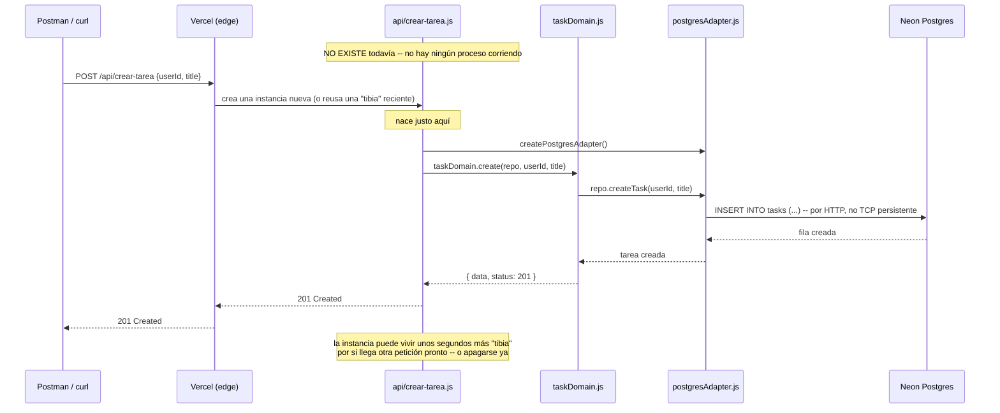

# Práctica 9 — Serverless

## Objetivo

Dejar de pensar en "un servidor que siempre está prendido, esperando
peticiones" y pasar a **funciones sueltas que no existen hasta que alguien
las llama**. Nada de `docker-compose up`, nada de contenedores corriendo
en segundo plano, nada de `app.listen()` en ningún puerto. Cada función
vive el tiempo que tarda en responder una petición, y ni un segundo más.

## Qué construimos sobre la práctica anterior

Esta es la práctica que más se aparta del resto del taller — y a
propósito. Por primera vez, **no corre dentro de tu Docker Compose
local**. Vamos a desplegar código real a un proveedor de nube (Vercel),
con una base de datos real en la nube (Postgres, vía Neon) — no porque
sea más complicado por complicarlo, sino porque "serverless" **significa**
justamente eso: tu código deja de vivir en una máquina que tú administras.

Lo que sí se conserva, y es el punto central de esta práctica:

| Pieza de prácticas anteriores | En esta práctica |
|---|---|
| `domain/taskDomain.js` | **Idéntico, byte a byte**, a las Prácticas 4-8 |

Sí, leíste bien: es la única fila de la tabla. Todo lo demás -- Docker,
Express, MySQL, RabbitMQ, el api-gateway -- desaparece. Lo único que
sobrevive de siete prácticas de evolución arquitectónica es el dominio
puro. Esa es la demostración final de la lección que empezamos en la
Práctica 4 (Hexagonal): si de verdad aíslas las reglas de negocio de la
tecnología, puedes cambiar la tecnología **por completo** -- hasta el
modelo de despliegue mismo -- sin tocarlas.

Lo nuevo:

- **`adapters/postgresAdapter.js`**: habla con una base de datos Postgres
  (no MySQL) usando `@neondatabase/serverless` -- un driver que se
  comunica por HTTP, no por una conexión TCP persistente (ver el
  comentario en el archivo para la explicación técnica de por qué eso
  importa en un entorno serverless).
- **`api/crear-tarea.js`** y **`api/listar-tareas.js`**: dos funciones
  independientes, cada una en su propio archivo. No hay un "servidor"
  que las contenga a las dos -- Vercel las descubre por convención (todo
  archivo dentro de `api/` se convierte automáticamente en un endpoint)
  y las ejecuta por separado, cada una en su propia instancia efímera.
- **`schema.sql`**: lo corres tú, una sola vez, a mano, en el editor SQL
  de Neon -- no hay ningún contenedor que lo corra por ti al arrancar,
  porque aquí no hay "arrancar".

## Requisitos previos

- Una cuenta gratuita en [Vercel](https://vercel.com) (puedes entrar con
  tu cuenta de GitHub).
- Una cuenta en GitHub, con este código subido a un repositorio tuyo
  (puede ser el mismo `Taller-de-Arquitecturas-de-Software`, o uno
  aparte -- ver la sección de despliegue).
- **Guarda los "recovery codes" (códigos de recuperación) que Vercel o
  GitHub te ofrezcan al activar verificación en dos pasos, en cuanto te
  los muestren.** Son la única forma de recuperar el acceso a tu cuenta
  si pierdes tu segundo factor (el teléfono, la app de autenticación,
  etc.) -- y solo se muestran una vez, en el momento de activarla. Un
  lugar seguro fuera de la propia cuenta (un gestor de contraseñas, una
  nota física) es mejor que un archivo de texto suelto en tu escritorio.
- Haber revisado la diapositiva **"Serverless"**.

## Estructura de archivos

```
09-serverless/
├── README.md
├── package.json
├── schema.sql                  -- corres esto a mano en Neon, una vez
├── .env.example                -- copia a .env para probar en tu máquina
├── .gitignore
├── domain/
│   └── taskDomain.js           ← idéntico a las Prácticas 4-8
├── adapters/
│   └── postgresAdapter.js      ← NUEVO -- Postgres vía Neon
└── api/
    ├── crear-tarea.js          ← NUEVO -- POST /api/crear-tarea
    └── listar-tareas.js        ← NUEVO -- GET /api/listar-tareas
```

Nota lo que **no** hay: ni `Dockerfile`, ni `docker-compose.yml`, ni
`nginx.conf`, ni `index.js` con un `app.listen()`. No es que se nos
haya olvidado -- ninguno de esos conceptos aplica aquí.

## Instrucciones paso a paso (despliegue real, cada quien el suyo)

1. **Sube esta carpeta a un repositorio de GitHub tuyo.** Si prefieres
   no crear un repo nuevo, un repositorio con solo esta carpeta adentro
   funciona perfecto -- Vercel no necesita el resto del taller.

2. **Crea un proyecto en Vercel a partir de ese repositorio:**
   - Entra a [vercel.com](https://vercel.com), inicia sesión con GitHub.
   - "Add New..." -> "Project" -> selecciona tu repositorio.
   - Framework Preset: déjalo en "Other" (no es Next.js ni ningún
     framework -- son funciones sueltas).
   - Dale clic a **Deploy**. La primera vez va a fallar al llamar a las
     funciones (todavía no hay base de datos conectada) -- es normal,
     seguimos.

3. **Conecta una base de datos Postgres (Neon), desde el propio
   dashboard de Vercel:**
   - Dentro de tu proyecto ya creado, ve a la pestaña **Storage**.
   - **Create Database** -> elige **Neon** (Postgres) entre las
     opciones -- puede que veas también Supabase u otras; para esta
     práctica, Neon.
   - Elige la región más cercana y el plan gratuito. Nómbrala como
     quieras (por ejemplo `gestor-tareas-db`).
   - Conéctala a tu proyecto -- Vercel agrega automáticamente la
     variable de entorno `DATABASE_URL` (y `DATABASE_URL_UNPOOLED`) a tu
     proyecto. No la copies ni la pegues a mano -- eso es justo lo que
     esta integración hace por ti.

4. **Crea la tabla, una sola vez, a mano:**
   - Desde la pestaña **Storage**, botón **Open in Neon Console**.
   - Ve al **SQL Editor** y pega el contenido completo de `schema.sql`
     de este repo. Ejecútalo.

5. **Vuelve a desplegar** (Vercel -> pestaña **Deployments** -> el
   deployment más reciente -> menú "..." -> **Redeploy**), para que las
   funciones arranquen ya con `DATABASE_URL` disponible.

6. **Prueba tus dos funciones**, ya con tu URL real de Vercel (algo como
   `https://tu-proyecto.vercel.app`):
   ```
   curl -X POST https://tu-proyecto.vercel.app/api/crear-tarea \
     -H "Content-Type: application/json" \
     -d '{"userId": 1, "title": "Mi primera tarea serverless"}'

   curl "https://tu-proyecto.vercel.app/api/listar-tareas?userId=1"
   ```

## Qué deberías observar

- **No hay ningún proceso "corriendo" para ti verlo.** No hay un
  `docker-compose ps` que valga aquí -- entra al dashboard de Vercel,
  pestaña **Functions**, y vas a ver el historial de invocaciones (cada
  vez que llamaste a `/api/crear-tarea` o `/api/listar-tareas`), no un
  proceso vivo. Entre invocación e invocación, no hay nada.
- **El primer request después de un rato de inactividad tarda más
  ("cold start").** Prueba llamar a `/api/listar-tareas` dos veces
  seguidas, rápido -- la segunda debería responder notablemente más
  rápido que la primera si pasó suficiente tiempo desde la última
  llamada. Eso es la instancia "calentándose" la primera vez.
- **Cada función es completamente independiente.** Revisa los logs de
  `/api/crear-tarea` en el dashboard de Vercel -- nunca vas a ver ahí
  ninguna mención de `/api/listar-tareas`, ni viceversa. No comparten
  memoria, ni proceso, ni nada -- lo único que comparten es la misma
  base de datos.

### Por qué el driver de conexión es distinto (y por qué eso importa)

Si intentaras usar `pg` (el driver normal de Postgres para Node, el que
usarías en un servidor tradicional) en una función serverless, cada
invocación abriría su propia conexión TCP nueva -- y con cientos de
invocaciones por segundo (el caso de uso para el que serverless está
pensado), agotarías el límite de conexiones simultáneas de la base de
datos casi de inmediato. `@neondatabase/serverless` evita esto hablando
por HTTP en vez de mantener una conexión abierta -- exactamente la razón
por la que este archivo se ve distinto a `dbAdapter.js` de las prácticas
anteriores, aunque haga conceptualmente lo mismo.

## Diagrama de secuencia

### El ciclo de vida completo de UNA invocación

Vale la pena verlo una vez de principio a fin, porque es el único
diagrama del taller donde el propio servicio nace y muere dentro del
diagrama -- en todas las prácticas anteriores, el servicio ya estaba
vivo antes de que empezara la petición.



Compáralo mentalmente con el Diagrama 1 de la Práctica 5
(Microservicios): ahí, `servicio-tareas` ya estaba corriendo, escuchando
en su puerto, desde antes de que llegara la primera petición del día.
Aquí, `api/crear-tarea.js` no es un proceso al que le "llega" una
petición -- es una petición la que **provoca que el proceso exista**.

## Postman

La colección incluye las dos peticiones (`POST /api/crear-tarea`,
`GET /api/listar-tareas`), con `base_url` como variable -- cámbiala a
tu propia URL de Vercel antes de correrlas (cada alumno tiene la suya).

## Errores comunes y solución

| Problema | Causa probable | Solución |
|---|---|---|
| Las funciones responden `500` con algo sobre `DATABASE_URL` | Desplegaste antes de conectar la base de datos, o no volviste a desplegar después de conectarla | Repite el paso 5 ("Redeploy") después de conectar Neon |
| `relation "tasks" does not exist` | Se te olvidó correr `schema.sql` en el SQL Editor de Neon | Repite el paso 4 |
| `404 NOT_FOUND` (página de error de Vercel, no un JSON) al llamar a `/api/crear-tarea` o `/api/listar-tareas` | Casi siempre: el repo de GitHub tiene una carpeta contenedora de más -- por ejemplo `mi-repo/09-serverless/api/...` en vez de `mi-repo/api/...`. Pasa fácil si arrastraste la carpeta descomprimida completa a tu explorador de archivos y el `git init` quedó un nivel arriba de donde debía. Revisa la ruta de tu repo en GitHub para confirmarlo (¿ves `api/` directo en la raíz, o dentro de otra carpeta?) | En Vercel: **Settings -> Build and Deployment -> Root Directory -> Edit**, escribe el nombre exacto de esa subcarpeta (p. ej. `09-serverless`), **Save**. Luego **Deployments -> el más reciente -> "..." -> Redeploy** -- el cambio de Root Directory no aplica al deployment que ya existe, solo al siguiente |
| Al volver al dashboard justo después de un Redeploy, aparece un "Something went wrong" pasajero | Glitch de interfaz -- el dashboard tarda un instante en refrescar el estado justo después de que termina un despliegue | Refresca la página (F5); si tus funciones ya responden bien y no vuelve a aparecer, no hay nada que arreglar. Si se repite de forma consistente, sí revisa la pestaña Logs de ese deployment |
| Todo funciona en un compañero y a ti no | Cada quien tiene su propia base de datos y su propio despliegue -- no hay nada compartido entre alumnos aquí, a diferencia de todo el taller anterior | Revisa tus propios logs en tu propio dashboard de Vercel, no compares directamente con el de alguien más |

## Preguntas de reflexión

1. En toda la Práctica 5 (Microservicios) discutimos qué pasa cuando un
   servicio se cae. En esta práctica, ¿qué significa siquiera la
   pregunta "¿qué pasa si la función se cae"? ¿Sigue aplicando el mismo
   tipo de análisis?
2. `domain/taskDomain.js` sobrevivió sin cambios ocho prácticas seguidas,
   incluyendo esta, el cambio más grande de todos. ¿Qué tendría que pasar
   para que el dominio SÍ tuviera que cambiar? (Piensa en una regla de
   negocio, no en infraestructura.)
3. Esta práctica solo construyó dos funciones (crear y listar). Si
   quisieras agregar "completar tarea" como una tercera función, ¿qué
   archivo(s) tendrías que crear o tocar, y cuáles definitivamente no?

## Entregable

1. Link a tu despliegue real en Vercel (`https://tu-proyecto.vercel.app`).
2. Captura de la pestaña **Storage** de tu proyecto mostrando la base de
   datos Neon conectada.
3. Captura de la pestaña **Functions** con al menos una invocación de
   cada una de las dos funciones.
4. Captura de las dos peticiones respondiendo correctamente (Postman o
   `curl`), contra tu URL real -- no `localhost`.
5. `REFLEXION.md` con tus respuestas a las 3 preguntas.
